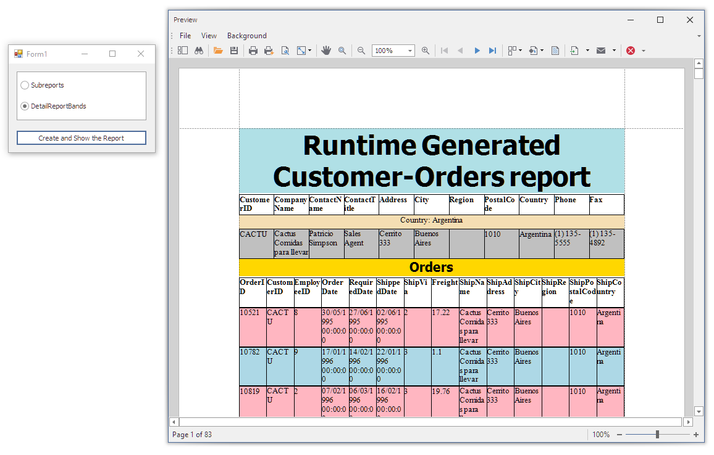

<!-- default badges list -->

<!-- default badges end -->

# Reporting for WinForms - Master-Detail Report Created in Code (obsolete)

This example shows how to create a master-detail report in code. 

> **Note**
> This example uses the ADO.NET library with a Microsoft Access database and [legacy Data Bindings](https://docs.devexpress.com/XtraReports/401991/detailed-guide-to-devexpress-reporting/use-report-controls/bind-report-controls-to-data/migrate-from-legacy-data-bindings-to-expressions).

The following steps are essential to create a report layout:
1. Create a report instance and bind it to data.
2. Add report bands to the report.
3. Add report controls to the created bands and create data bindings.

After the report layout is complete, generate the report document and display it in the **Print Preview** dialog window.

## Files to Look At

* **[Form1.cs](./CS/MasterDetailAtRuntime/Form1.cs) (VB: [Form1.vb](./VB/MasterDetailAtRuntime/Form1.vb))**

## Documentation

- [Create a Report in Visual Studio](https://docs.devexpress.com/XtraReports/14989/get-started-with-devexpress-reporting/create-a-report-in-visual-studio)
- [Introduction to Banded Reports](https://docs.devexpress.com/XtraReports/2587/detailed-guide-to-devexpress-reporting/introduction-to-banded-reports)
- [Use Report Controls](https://docs.devexpress.com/XtraReports/2605/detailed-guide-to-devexpress-reporting/use-report-controls)
- [Bind Reports to Data](https://docs.devexpress.com/XtraReports/15034/detailed-guide-to-devexpress-reporting/bind-reports-to-data)
- [WinForms Reporting Print Preview](https://docs.devexpress.com/XtraReports/10707/winforms-reporting/winforms-reporting-print-preview)
- [Create Reports](https://docs.devexpress.com/XtraReports/5152/create-reports)

## More Examples

- [Reporting for WinForms - How to Create a Report Bound to the SQL Data Source](https://github.com/DevExpress-Examples/reporting-winforms-sql-data-source-runtime)
- [Reporting for WinForms - Create a Report Dynamically and Bind It to a DataSet](https://github.com/DevExpress-Examples/reporting-winforms-create-report-dynamically-and-bind-it-to-dataset) 
- [How to dynamically generate a report and bind it to a collection of objects](https://github.com/DevExpress-Examples/Reporting_how-to-dynamically-generate-a-report-and-bind-it-to-a-collection-of-objects-e652)
- [How to bind a report to a federated data source](https://github.com/DevExpress-Examples/Reporting-Bind-Report-To-Federated-Data-Source)